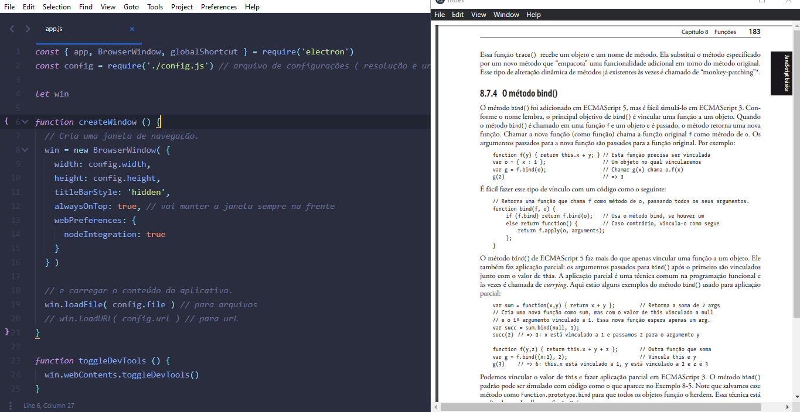

<h1 align="center">Navegador Flutuante</h1>

 

## Tecnologias

Esse projeto foi desenvolvido com as seguintes tecnologias:

- [x] [Node.js](https://nodejs.org/en/)
- [x] [Electron](https://www.electronjs.org/)

## 💻 Projeto

O Navegador Flutuante é um uma janela simples que fica sempre com um 'z-index' igual a '9999999' onde mesmo que você tire o foco dele
ele irá permanecer na frente de qualquer janela.

## Instalação

- `git clone https://github.com/Rogerluiz0/navegador-flutuante.git`;
- `cd navegador-flutuante`;
- `npm install`;
- `npm start`.
